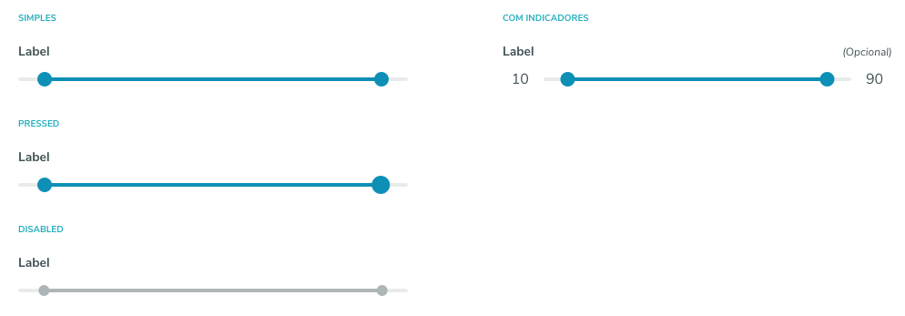

# PO UI Desafio Frontend

Construa um componente `Range`, conforme a imagem abaixo, para ser utilizado em uma aplicação Angular



## Especificação

Propriedades que o componente deve possuir:

- **min**: Valor mínimo (default: 0)

- **max**: Valor máximo (default: 100)

- **label**: Rótulo do campo, indica sobre qual informação pertence.

- **disabled**: Desabilita a interação do componente;

- **opcional**: Informa que o componente é opcional;

- **hide-values**: Esconde os valores do componente.


Além dessas propriedades, deve ser possivel informar tanto [(ngModel)] (Template Driven) quanto formControlName (Reactive Forms)

### Exemplo de uso

```
<app-range 
  [(ngModel)]="rangeValue"
  label="Intervalo entre valores"
  opcional>
</app-range>
```

```
<app-range 
  [(ngModel)]="rangeValue"
  label="Intervalo entre valores"
  min="50"
  max="250">
</app-range>
```

```
<app-range
  [(ngModel)]="rangeValue"
  label="Intervalo entre valores"
  disabled
  hide-values>
</app-range>
```

Pode-se utilizar nossos reposítorios como consulta e também nosso styleguide de codificação:
- [Campos de entrada do PO UI](https://github.com/po-ui/po-angular/tree/master/projects/ui/src/lib/components/po-field)
- [Styleguide de codificação](https://github.com/po-ui/po-angular/blob/master/STYLEGUIDE.md)

## Requisitos

- Utilize o Angular mais atualizado
- Não utilize outros frameworks (bootstrap/material)
- O componente precisa ser responsivo
- Teste unitário usando Jasmine + Karma
- Documentação no formato Markdown
- Crie 2 exemplos de uso, um basico e outro mais avançado.

## Submissão

 - Criar um fork desse projeto e entregar via Pull Request.

## Prazo de Entrega

- 3 Dias.

# 

# Boa Sorte
